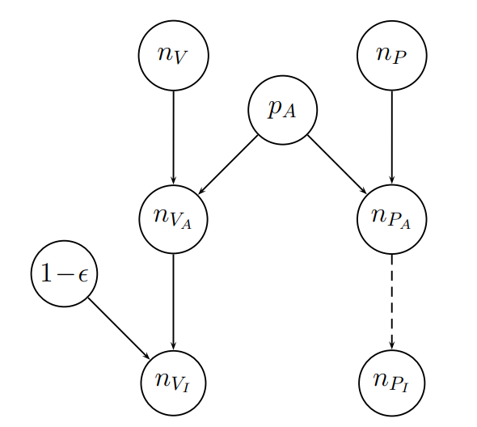

```{r setup, include=FALSE}

#knitr::opts_chunk$set(echo = TRUE)
```

# Introduction 
<font size="3">

- Our goal: obtain the probability distribution of the efficacy
- Tools: Bayesian Network + Markov Chain Monte Carlo 
</font>
<br />
<br />
From Moderna’s press release (November 16, 2020): *" This first interim analysis was based on 95 cases, of which 90 cases of COVID-19 were observed in the placebo group versus 5 cases observed in the mRNA-1273 group, resulting in a <span style="color: red;"> point estimate of vaccine efficacy of 94.5% (p <0.0001)</span>"*
<br />
<br />

{width=60%}
<br />
<br />

{width=60%}

# Set up the model
## Bayesian Network
{width=50%}

- $n_{V}$ = number of individuals in the vaccine group
- $n_{P}$ = number of individuals in the placebo group
- $n_{V_{I}}$ and $n_{P_{I}}$ = number of infected individual, in the two groups, after the trial period
- $p_{A}$ = assault probability
- $n_{V_{A}}$ and $n_{P_{A}}$ = number of assaulted individuals in each group
<br />
<br />
<font size= "3">
The assaulted individuals of the vaccinated group are protected by the vaccine. If $\epsilon$ is the **efficacy** of the vaccine, the probability for them of being infected is equal to 1 − $\epsilon$ .
<br />
<br />
<center>
$n_{V_{A}} \sim Binom(n_{V},p_{A})$
<br />
<br />
$n_{P_{A}} \sim Binom(n_{P},p_{A})$
<br />
<br />
$n_{V_{I}} \sim Binom(n_{V_{A}},1-\epsilon)$
</center>
<br />
<br />
The calculation is done through a MCMC with the help of the program `JAGS`, that is interfaced with `R` via the package `rjags`

```{r}
library(rjags)
```
## BUGS model
The model written in `BUGS` language is: 
```{r}
# DEFINE the MODEL 
model_vaccine <- "model{
nP.I ~ dbin(pA, nP)         # dbinom() in R 
nV.A ~ dbin(pA, nV) 
nV.I ~ dbin(prob, nV.A)     # prob = 1 - epsilon

# Priors of nodes with no parents 
pA ~ dbeta(1,1) 
prob ~ dbeta(1,1) 

epsilon <- 1 - prob         # the quantity we want to trace in the chain 
}"

```
The priors both for the $p_{A}$ and $prob$ (= the probability that an assaulted vaccinated person being infected) are **uniform priors**.

# Data
<center>
Moderna: $n_{V_{I}} = 5$ $~$$~$$~$ $n_{P_{I}}=90$
<br />
Pfizer:  $n_{V_{I}} = 8$ $~$$~$$~$ $n_{P_{I}}=162$
</center>
<br />
What about $n_{V}$ and $n_{P}$ ? The exact number is not critical at all in regard to the value of efficacy (if they are enough larger than $n_{V_{I}}$ and $n_{P_{I}}$)


# Analysis and Results
The model is red using the `jags.model` function. The latter creates an object of the class `jags`.

$~$
```{r}
# function to COMPILE THE MODEL

model_jags <- function(data) {
  m_j <- jags.model(textConnection(model_vaccine),data=data,inits = list(.RNG.name= "base::Wichmann-Hill", .RNG.seed=123))
  return(m_j)                                             
}

# DATA
Moderna <- list(nV.I=5,nP.I=90,nV=15000,nP=15000)
Pfizer <- list(nV.I=8,nP.I=162,nV=15000,nP=15000)

model_jags_Moderna <- model_jags(Moderna)
model_jags_Pfizer <- model_jags(Pfizer)
```

```{r}
# Update the Markov chain (Burn-in)
update(model_jags_Moderna, 1000) 
update(model_jags_Pfizer, 1000) 
```
Samples from the model are extracted using the `coda.samples` function. The latter creates an object of the class `mcmc.list`, that is a *summary* of the posterior distribution.
<br />
<br />
Arguments: `model` = our model, `variable.names` = values we want to trace in the chain, `n.iter` = steps to run the chain
```{r}
# SIMULATE the posterior -> draw 100'000 approximated samples from the posterior
draw.posterior <- function(model){
  sim <- coda.samples(model=model,variable.names = c("epsilon","nV.A"),n.iter=100000)
  return(sim)
} 
```

```{r}
posterior_moderna <- draw.posterior(model_jags_Moderna)
Summary_Moderna <- summary(posterior_moderna)
Summary_Moderna
```
```{r}
posterior_pfizer <- draw.posterior(model_jags_Pfizer)
Summary_Pfizer <- summary(posterior_pfizer)
Summary_Pfizer
```

```{r}
Summary_Moderna$statistics
```

```{r}
epsilonM_mean <- Summary_Moderna$statistics[1,1]
epsilonM_std <- Summary_Moderna$statistics[1,2]
mean.nV.A_M <- Summary_Moderna$statistics[2,1]
std.nV.A_M <- Summary_Moderna$statistics[2,2]

Summary_Pfizer$statistics
```

```{r}
epsilonP_mean <- Summary_Pfizer$statistics[1,1]
epsilonP_std <- Summary_Pfizer$statistics[1,2]
mean.nV.A_P <- Summary_Pfizer$statistics[2,1]
std.nV.A_P <- Summary_Pfizer$statistics[2,2]
```

In the following, plots for the simulated posterior.
```{r fig,fig.height = 4,fig.width = 14}
plot(posterior_moderna[,1],trace=TRUE,col="navy",main =  ~ epsilon ~ "Moderna's vaccine",cex.lab=1.5, cex.axis=1.5, cex.main=1.6 )
```

```{r figure,fig.height = 4,fig.width = 14}
#, figures-side, fig.show="hold", out.width="50%"}
plot(posterior_pfizer[,1],trace=TRUE,col="navy",main =  ~ epsilon ~ "Pfizer's vaccine",cex.lab=1.5, cex.axis=1.5, cex.main=1.6 )

```

```{r fig2,fig.height = 4,fig.width = 14}
plot(posterior_moderna[,2],trace=TRUE,col="sienna1",main = "nV.A Moderna's vaccine",cex.lab=1.5, cex.axis=1.5, cex.main=1.6 )
```


```{r figura2,fig.height = 4,fig.width = 14}
plot(posterior_pfizer[,2],trace=TRUE,col="sienna1",main ="nV.A Pfizer's vaccine",cex.lab=1.5, cex.axis=1.5, cex.main=1.6 )
```
```{r ,fig.height = 4,fig.width = 14,include=FALSE}
plot(posterior_moderna[,2],trace=TRUE,col="firebrick",main = "pA Moderna's vaccine",cex.lab=1.5, cex.axis=1.5, cex.main=1.6 )
```
```{r ppa,fig.height = 4,fig.width = 14,include=FALSE}
plot(posterior_pfizer[,2],trace=TRUE,col="firebrick",main ="pA Pfizer's vaccine",cex.lab=1.5, cex.axis=1.5, cex.main=1.6 )
```

```{r}
# Calculation of the MODE 

# Moderna
samples_matrixM <- as.matrix(posterior_moderna, chains = TRUE) # this method removes the MCMC attributes from an mcmc object and returns a matrix
head(samples_matrixM,5)
density_M <- density(samples_matrixM[,2]) # compute the the density with "density" function
#plot(density_M) --> it is the same as the previous plot
index_maxM <- which.max(density_M$y)

# Pfizer
samples_matrixP <- as.matrix(posterior_pfizer, chains = TRUE)
density_P <- density(samples_matrixP[,2])
#plot(density_P)  --> it is the same as the previous plot
index_maxP <- which.max(density_P$y)


modeM <- density_M$x[index_maxM]
cat(paste("The MODE of the density of Moderna's vaccine efficacy is", modeM ,"\n"))
modeP <- density_P$x[index_maxP]
cat(paste("The MODE of the density of Pfizer's vaccine efficacy is", modeP ,"\n"))
```

```{r}
Summary_Moderna$quantiles
cat(paste('The 95% credible interval for Moderna efficacy with DIRECT method is [',round(Summary_Moderna$quantiles[1,1]*100,1),'%,',round(Summary_Moderna$quantiles[1,5]*100,1),'%] \n '))
```

```{r}
CI <- function(x,posterior,delta){
  l <- x[which.min(abs(cumsum(posterior*delta)-0.025))]
  h <- x[which.min(abs(cumsum(posterior*delta)-0.975))]
  newList <- list("low" = l, "high" = h)
  return(newList)
} 

#function parameters for Moderna
xM <- density_M$x
posteriorM <- density_M$y
deltaM <- xM[2]-xM[1]

#function parameters for Pfizer
xP <- density_P$x
posteriorP <- density_P$y
deltaP <- xP[2]-xP[1]

lowM <- CI(xM,posteriorM,deltaM)$low 
highM <- CI(xM,posteriorM,deltaM)$high

lowP <- CI(xP,posteriorP,deltaP)$low
highP <- CI(xP,posteriorP,deltaP)$high

cat(paste('The 95% credible interval for Moderna efficacy is [',lowM,',',highM,'] \n '))
```


```{r}
cat(paste('The 95% credible interval for Pfizer efficacy is [',lowP,',',highP,']'))
```

```{r}
Summary_Pfizer$quantiles
cat(paste('The 95% credible interval for Pfizer efficacy with DIRECT method is [',round(Summary_Pfizer$quantiles[1,1]*100,digit=1),'% ,',round(Summary_Pfizer$quantiles[1,5]*100,digits=1),'%] \n '))
```


```{r plottini, figures-side, fig.show="hold", out.width="50%"}
# MODERNA plot
plot(posterior_moderna[,1],trace=FALSE,col="navy",xlab=expression(epsilon),main="Density of" ~ epsilon ~ "Moderna's vaccine",lwd=2,cex.lab=1.5, cex.axis=1.5, cex.main=1.6)
abline(v = epsilonM_mean, col="red", lwd=3, lty=2)
abline(v = density_M$x[index_maxM], col="navy", lwd=3, lty=2)
text(density_M$x[index_maxM],         # position of text on x-axis
     5,                                               # position of text on y-axis
     round(density_M$x[index_maxM],digits = 3),         # text to be plotted
     pos = 4,col = "navy",cex=1.5) 
text(0.90,                                    # position of text on x-axis
     6,                                               # position of text on y-axis
     round(epsilonM_mean,3),         # text to be plotted
     pos = 4,col = "red",cex=1.5) 
rect(lowM, 0, highM, 16, density = 10, border = "azure3", col = "azure3")
       
legend(0.76, 10, legend=c("mean", "mode","95% CI"),
       col=c("red", "navy","azure3"), lty=c(2,2,2),lwd=c(3,3,10), cex=1.3) 
#par(new=TRUE)

# PFIZER plot
plot(posterior_pfizer[,1],trace=FALSE,col="navy",xlab=expression(epsilon),main="Density of" ~ epsilon ~ "Pfizer's vaccine",lwd=2,cex.lab=1.5, cex.axis=1.5,cex.main=1.6)
abline(v = epsilonP_mean, col="red", lwd=3, lty=2)
abline(v = density_P$x[index_maxP], col="navy", lwd=3, lty=2)
text(density_P$x[index_maxP],         # position of text on x-axis
     10,                                               # position of text on y-axis
     round(density_P$x[index_maxP],digits = 3),         # text to be plotted
     pos = 4,col = "navy",cex=1.5) 
text(0.92,         # position of text on x-axis
     8,                                               # position of text on y-axis
     round(epsilonP_mean,3),         # text to be plotted
     pos = 4,col = "red",cex=1.5) 

rect(lowP, 0, highP, 25,density=10, border = "azure3", col = "azure3")
legend(0.82, 13, legend=c("mean", "mode","95% CI"),
       col=c("red", "navy","azure3"), lty=c(2,2,2),lwd=c(3,3,10), cex=1.3) 
```

The *media claims* and the *press release* results of the two companies correspond to the *modal values* of the two distribution

```{r}
cat(paste("The mean and the corresponding std for Moderna's efficacy \n",round(epsilonM_mean,3) ,"+/-",round(epsilonM_std,3),"\n "))
```

```{r}
cat(paste("The mean and the corresponding std for Pfizer's efficacy \n",round(epsilonP_mean,3) ,"+/-",round(epsilonP_std,3),"\n "))
```


```{r}
cat(paste("The mean and the corresponding std for Moderna's nV.A \n",round(mean.nV.A_M,0) ,"+/-",round(std.nV.A_M,0),"\n" ))
```

```{r}
cat(paste("The mean and the corresponding std for Pfizer's nV.A \n",round(mean.nV.A_P,0),"+/-",round(std.nV.A_P,0),"\n" ))
```

Same order of magnitude of the number of infected of the placebo groups, $n_{P_{I}}$ 
<br />
<br />
<center>
Moderna: $n_{P_{I}}$=90

Pfizer: $n_{P_{I}}$=162
</center>
# Histrograms of the MCMC data
```{r}
posterior_P.df <- as.data.frame(as.mcmc(posterior_pfizer))
head(posterior_P.df,5)
```

```{r}
posterior_M.df <- as.data.frame(as.mcmc(posterior_moderna))
head(posterior_M.df,5)
```

```{r , figures-side, fig.show="hold", out.width="50%"}
hist(posterior_P.df$epsilon,density=40, nc=50, prob=TRUE , col='navy',
xlab=expression(epsilon), ylab='f(p)', main='Inference on'~ epsilon ~ "Pfizer" , cex.lab=1.5, cex.axis=1.5,cex.main=1.6)
abline(v = mean(posterior_P.df$epsilon), col="black", lwd=3, lty=2)
text(mean(posterior_P.df$epsilon),         # position of text on x-axis
     10,                 # position of text on y-axis
     round(mean(posterior_P.df$epsilon),3),         # text to be plotted
     pos = 4,col = "black",cex=1.5) 
par(new=TRUE)
plot(posterior_pfizer[,1],trace=FALSE,col="navy",axes=FALSE,lwd=3, lty=2)

legend(0.83, 15, legend=c("mean","jags result"),
       col=c("black","navy"), lty=c(2,2),lwd=c(3,3), cex=1.3) 


plot(posterior_pfizer[,2],trace=FALSE,col='#FF000088',lwd=3, lty=2)
par(new=TRUE)
hist(posterior_P.df$nV.A, density=40,nc=50, prob=TRUE ,axes=FALSE, col='blue',
xlab='nV.A', ylab='f(nV.A)', main='Inference on nV.A, Pfizer', cex.lab=1.5, cex.axis=1.5,cex.main=1.6)
abline(v = mean.nV.A_P, col="black", lwd=3, lty=2)
text(mean.nV.A_P,         # position of text on x-axis
     0.010,                 # position of text on y-axis
     round(mean.nV.A_P,0),         # text to be plotted 
     pos = 4,col = "black",cex=1.5) 


legend(203, 0.015, legend=c("mean","jags result"),
       col=c("black",'#FF000088'), lty=c(2,1),lwd=c(3,10), cex=1.3) 
```
```{r hh, figures-side, fig.show="hold", out.width="50%"}
hist(posterior_M.df$epsilon,density=40, nc=50, prob=TRUE , col='navy',
xlab=expression(epsilon), ylab='f(p)', main='Inference on'~ epsilon ~ ", Moderna" , cex.lab=1.5, cex.axis=1.5,cex.main=1.6)
abline(v = mean(posterior_M.df$epsilon), col="black", lwd=3, lty=2)
text(0.93,         # position of text on x-axis
     5,                 # position of text on y-axis
     round(mean(posterior_M.df$epsilon),3),         # text to be plotted
     pos = 4,col = "black",cex=1.5) 

legend(0.76, 12, legend=c("mean","jags result"),
       col=c("black","navy"), lty=c(2,2),lwd=c(3,3), cex=1.3) 
par(new=TRUE)
plot(posterior_moderna[,1],trace=FALSE, axes=FALSE,col="navy",lty=2,lwd=3)

plot(posterior_moderna[,2],trace=FALSE,col='#FF000088',lwd=3, lty=2)
par(new=TRUE)
hist(posterior_M.df$nV.A, density=40,nc=50, prob=TRUE ,axes=FALSE, col='blue',
xlab='nV.A', ylab='f(nV.A)', main='Inference on nV.A, Moderna', cex.lab=1.5, cex.axis=1.5,cex.main=1.6)
abline(v = mean.nV.A_M, col="black", lwd=3, lty=2)
text(mean.nV.A_M,         # position of text on x-axis
     0.010,                 # position of text on y-axis
     round(mean.nV.A_M,0),         # text to be plotted
     pos = 4,col = "black",cex=1.5) 

legend(120, 0.025, legend=c("mean","jags result"),
       col=c("black","#FF000088"), lty=c(2,1),lwd=c(3,10), cex=1.3) 
```


```{r, include=FALSE}
cat(sprintf("\n Correlation matrix (Moderna chain): \n \n"))
print(cor(posterior_M.df))
```
```{r ,include=FALSE}
cat(sprintf("\n Correlation matrix (Pfizer chain): \n \n"))
print(cor(posterior_P.df))
```
```{r corr, figures-side, fig.show="hold", out.width="50%",include=FALSE}
plot(posterior_M.df$epsilon, posterior_M.df$nV.A, xlab=expression(epsilon), ylab="nV.A", main="Correlation between"~ epsilon ~ "and nV.A (Moderna)",pch="+", col='firebrick', cex=1)

plot(posterior_P.df$epsilon, posterior_P.df$nV.A, xlab=expression(epsilon), ylab="nV.A", main="Correlation between"~ epsilon ~ "and nV.A (Pfizer)",pch="+", col='firebrick', cex=1)
```


```{r hhpa, figures-side, fig.show="hold", out.width="50%",fig.height = 4,fig.width = 14,include=FALSE}
hist(posterior_M.df$epsilon,density=40, nc=50, prob=TRUE , col='navy',
 ylab='f(pA)', main="Inference on pA, Moderna" , cex.lab=1.5, cex.axis=1.5,cex.main=1.6)
abline(v = mean(posterior_M.df$epsilon), col="black", lwd=3, lty=2)
text(0.93,         # position of text on x-axis
     5,                 # position of text on y-axis
     round(mean(posterior_M.df$epsilon),3),         # text to be plotted
     pos = 4,col = "black",cex=1.5) 

legend(0.76, 12, legend=c("mean","jags result"),
       col=c("black","navy"), lty=c(2,2),lwd=c(3,3), cex=1.3) 
par(new=TRUE)
plot(posterior_moderna[,2],trace=FALSE, axes=FALSE,col="navy",lty=2,lwd=3)

plot(posterior_pfizer[,2],trace=FALSE,col='navy',lwd=3, lty=2)
par(new=TRUE)
hist(posterior_P.df$epsilon, density=40,nc=50, prob=TRUE ,axes=FALSE, col='blue',
ylab='f(pA)', main='Inference on pA, Pfizer', cex.lab=1.5, cex.axis=1.5,cex.main=1.6)
abline(v = mean(posterior_P.df$epsilon), col="black", lwd=3, lty=2)
text(mean(posterior_P.df$epsilon),         # position of text on x-axis
     300,                 # position of text on y-axis
     mean(posterior_P.df$epsilon),         # text to be plotted
     pos = 4,col = "black",cex=1.5) 

legend(120, 0.025, legend=c("mean","jags result"),
       col=c("black","navy"), lty=c(2,1),lwd=c(3,10), cex=1.3) 
```

# Convergence diagnostic 
If the run of the Markov Chain is long enough a random draw from the chain can be considered as a random draw from the posterior. Problem: one may get a chain not representative *at all* for the posterior. 
<br />
<br />
The trace plot provides "informal" diagnostic for the convergence of our chain.
<br />
Fortunately the `coda` package provides many convergence diagnostics. 


## Geweke diagnostic
<br />
<br />
$X_{1}$ and $X_{2}$ are the two samples, $T$ mean test
<br />
<br />
<center>
$T= \frac{\bar{X_{1}}-\bar{X_{2}}}{\sqrt{\frac{s1^2}{n}+\frac{s2^2}{m}}}$
</center>
<br />
When $n,m \rightarrow \infty$ $T$ can be approximated using the standard normal $Z$.
<br />
<br />
<center>
$Z = \frac{X-\mu}{\sigma}$
</center>
<br />
```{r}
cat(paste("Z-score of Moderna efficacy chain"),"\n")
geweke.diag(posterior_moderna[,1])     # z scores for a test of quality
cat(paste("Z-score of Moderna nV_A chain"),"\n")
geweke.diag(posterior_moderna[,2])
cat(paste("Z-score of Pfizer efficacy chain"),"\n")
geweke.diag(posterior_pfizer[,1])
cat(paste("Z-score of Pfizer nV_A chain"),"\n")
geweke.diag(posterior_pfizer[,2])
```


## Autocorrelation plots
In a MCMC the samples will typically be autocorrelated (or anticorrelated) within a chain.
```{r autocorr, figures-side, fig.show="hold", out.width="50%"}
autocorr.plot(posterior_moderna[,1],main="Moderna"~ epsilon, cex.lab=1.5, cex.axis=1.5,cex.main=1.6,col="navy")
text(40,0.80,sprintf("effective size: %.2f",effectiveSize(posterior_moderna[,1])),cex=1)
autocorr.plot(posterior_moderna[,2],main="Moderna nV.A", cex.lab=1.5, cex.axis=1.5,cex.main=1.3,col="sienna1")
text(40,0.80,sprintf("effective size: %.2f",effectiveSize(posterior_moderna[,2])),cex=1)

```
```{r autocorrP, figures-side, fig.show="hold", out.width="50%"}
autocorr.plot(posterior_pfizer[,1],main="Pfizer"~ epsilon, cex.lab=1.5, cex.axis=1.5,cex.main=1.6,col="navy")
text(40,0.80,sprintf("effective size: %.2f",effectiveSize(posterior_pfizer[,1])),cex=1)
autocorr.plot(posterior_pfizer[,2],main="Pfizer nV.A", cex.lab=1.5, cex.axis=1.5,cex.main=1.3,col="sienna1")
text(40,0.80,sprintf("effective size: %.2f",effectiveSize(posterior_pfizer[,2])),cex=1)

```
```{r autocorrpa, figures-side, fig.show="hold", out.width="50%",fig.height = 4,fig.width = 14,include=FALSE}
autocorr.plot(posterior_moderna[,2],main="Moderna pA", cex.lab=1.5, cex.axis=1.5,cex.main=1.6,col="firebrick")
autocorr.plot(posterior_pfizer[,2],main="Pfizer pA", cex.lab=1.5, cex.axis=1.5,cex.main=1.3,col="firebrick")
```

```{r ,include = FALSE}
effectiveSize(posterior_moderna)
```
```{r, include = FALSE}
effectiveSize(posterior_pfizer)
```
# Size-independent model
Proof that the result for the *efficacy* does not depend on the initial $n_{V}$ and $n_{P}$. The proof is only for Moderna’s vaccine. 
```{r}
model_jags_proof <- function(nP) {
  M <- jags.model(textConnection(model_vaccine),data=list(nV.I=5,nP.I=90,nV=nP,nP=nP),inits = list(.RNG.name= "base::Wichmann-Hill", .RNG.seed=1234))
  return(M) 
}
n_init <- list(300,1500,15000)
moderna0 <- model_jags_proof(n_init[1])
moderna1 <- model_jags_proof(n_init[2])
moderna2 <- model_jags_proof(n_init[3])
```

```{r}
update(moderna0,1000)
update(moderna1,1000)
update(moderna2,1000)
```

```{r}
posterior_moderna0 <- draw.posterior(moderna0)
posterior_moderna1 <- draw.posterior(moderna1)
posterior_moderna2 <- draw.posterior(moderna2)
```

```{r}
plot(posterior_moderna0[,1],trace=FALSE,col="navy",main="Density of" ~ epsilon ~ "Moderna's vaccine",xlab=expression(epsilon),lwd=2,lty=2)
par(new=TRUE)
plot(posterior_moderna1[,1],trace=FALSE,col="firebrick",xlab=expression(epsilon),lwd=2,lty=2,axes=FALSE)
par(new=TRUE)
plot(posterior_moderna2[,1],trace=FALSE,col="green",xlab=expression(epsilon),lwd=2,lty=2,axes=FALSE)

legend(0.78, 13, legend=c("nV=nP=300", "nV=nP=1500","nV=nP=15000"),
       col=c("navy", "firebrick","green"), lty=c(2,2,2),lwd=c(2,2,2), cex=1.1) 
```
```{r,include=FALSE}
plot(posterior_moderna0[,2],trace=FALSE,col="navy",main="Density of pA Moderna's vaccine",xlab="pA",lwd=2,lty=2)
par(new=TRUE)
plot(posterior_moderna1[,2],trace=FALSE,col="firebrick",xlab="pA",lwd=2,lty=2,axes=FALSE)
par(new=TRUE)
plot(posterior_moderna2[,2],trace=FALSE,col="orange",xlab="pA",lwd=2,lty=2,axes=FALSE)

legend(0.20, 10, legend=c("nV=nP=300", "nV=nP=1500","nV=nP=15000"),
       col=c("navy", "firebrick","orange"), lty=c(2,2,2),lwd=c(2,2,2), cex=1.1) 
```
```{r,include=FALSE}
plot(posterior_moderna0[,2],trace=FALSE,col="navy",main="Density of pA Moderna's vaccine",xlab="pA",lwd=2,lty=2)
par(new=TRUE)
plot(posterior_moderna1[,2],trace=FALSE,col="firebrick",xlab="pA",lwd=2,lty=2,axes=FALSE)
par(new=TRUE)
plot(posterior_moderna2[,2],trace=FALSE,col="orange",xlab="pA",lwd=2,lty=2,axes=FALSE)

legend(0.35, 10, legend=c("nV=nP=300", "nV=nP=1500","nV=nP=15000"),
       col=c("navy", "firebrick","orange"), lty=c(2,2,2),lwd=c(2,2,2), cex=1.1) 
```

# Conclusion
- The performances of the two vaccines in terms of efficacy do not differ much
```{r}
cat(paste("The mean and the corresponding std for Moderna's efficacy \n (",round(epsilonM_mean*100,digits=1) ,"+/-",round(epsilonM_std*100,digits=1),") % \n"))
```

```{r}
cat(paste("The mean and the corresponding std for Pfizer's efficacy \n (",round(epsilonP_mean*100,digits=1) ,"+/-",round(epsilonP_std*100,digits=1),") %"))
```
```{r}
cat(paste('The MODE and the 95% CI for Moderna efficacy is \n',round(modeM*100,1),'%,  [',round(Summary_Moderna$quantiles[1,1]*100,1),'%,',round(Summary_Moderna$quantiles[1,5]*100,1),'%] \n '))
```
```{r}
cat(paste('The MODE and the 95% CI for Pfizer efficacy is \n',round(modeP*100,1),'%, [',round(Summary_Pfizer$quantiles[1,1]*100,1),'%,',round(Summary_Pfizer$quantiles[1,5]*100,1),'%] \n '))
```
*Bare* claims: 94.5% for Moderna and 95% for Pfizer

- Simplifying assumptions may affect the result (pA)
- The model allows us to infere the quantities of interest from few data publicly available
- The uncertainity over the efficacy must be present

# Reference
G. D'Agostini, A. Esposito **Inferring vaccine efficacies and their uncertainty** (2020)


